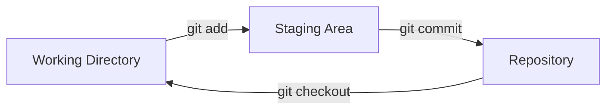
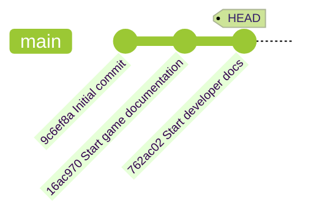
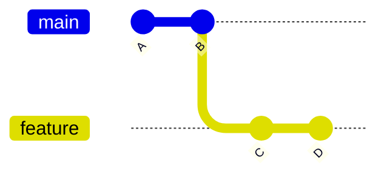
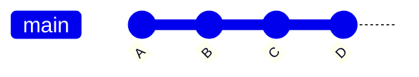
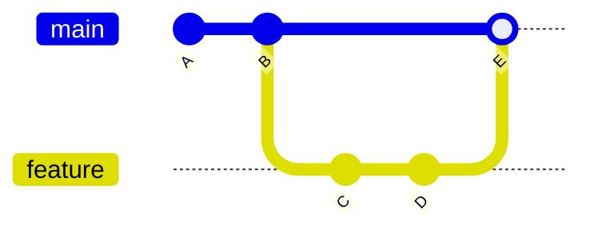
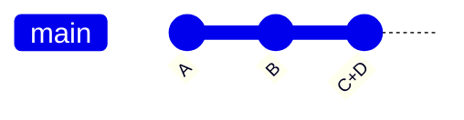

# 演習 1 日本語訳：Git の概要（Introduction to Git）

GitHub Skills「Introduction to Git」の日本語訳です。演習は英語で、自分のリポジトリの **Issues** に
Step 1 から順に表示されます。画面の英語と日本語訳を見比べながら進めてください。

- コマンド、ファイル名、ブランチ名、コミットメッセージは、画面と一致させるため英語のままにしています。**指定された名前は変えずに入力してください。** 自動チェックは名前を見ています。
- 演習では Codespace の中で CLI と VS Code を使います。Step は自分のリポジトリの Issues に順に投稿され、Codespace 内の監視プロセスが作業を検知して次の Step を出します。
- 各 Step を終えると、bot（Mona）が同じ Issue に次の Step をコメントします。出るまで 20〜30 秒待って、ページを再読み込みしてください。
- 時間の目安：35 分。授業では Step 1〜3 が必須です。Step 4〜6 は時間があれば、または授業後に取り組んでください。

**演習の開始**: [自分用のリポジトリを作成する](https://github.com/new?template_owner=skills&template_name=introduction-to-git&owner=%40me&name=skills-introduction-to-git&description=Exercise:+Introduction+to+Git&visibility=public)
→ **Create repository** を押し、20 秒待ってから再読み込み → **Issues** タブに Step 1 が出ます。

## 演習で扱う範囲

```text
作業ツリー ──git add──▶ ステージング領域 ──git commit──▶ ローカルの履歴（リポジトリ） ──git push──▶ GitHub
（編集中のファイル）      （次のコミットに入れる変更）    （コミットの積み重ね）                  （M02 から）
         ▲                                                      │
         └──────────────── git checkout（過去の状態を取り出す）──┘
```

演習では GitHub への push はしません。作業ツリー → ステージング → ローカル履歴までを扱います。

---

## Step 1: Git によるバージョン管理の概要（Introduction to Git Version Control）

あるプロジェクトに取り組んでいて、バックアップの整理が難しくなってきたことに気づきました。しかも、更新の共有方法が人によってばらばらで、共同作業がとても分かりにくい状態です。

少し調べてみて、[Git](https://git-scm.com/) というものを知りました。変更の追跡と他の人との共同作業が簡単になるそうです。ファイル名の付け方の工夫、共有ドライブ、メールでのファイル送付といった古いやり方の分かりにくさを解消してくれます。

> **重要**: 演習では、Git がすでにインストールされているマシンで Git の使い方を学びます。
> 自分のコンピューターにインストールしたい場合は、環境の組み合わせが多いため、公式の [Git サイト](https://git-scm.com) のインストール手順を参照してください。

### 📖 理論：バージョン管理とは

バージョン管理システムは、コードの変更を長期間管理するときに開発者が直面する、よくある問題を解決します。たとえば次のような問題です。

- バックアップと復旧
- 隔離された環境での実験
- 並行した開発
- ロックされたファイル
- ファイルの重複
- 競合する変更
- チームでの共同作業

次のような場面に出会ったことがあれば、Git のバージョン管理は役に立つはずです。😎

- `my-project-final-v2-really3.zip`
- 「いつから動かなくなった？ 何も変えてないのに！」（本当は変えている）
- 「ファイルがロックされている。彼が月曜に戻るまでコピーで作業しよう。」
- 「v2 が入っていたのはどのメールだっけ？ 先週の水曜のやつかな。」

### 「Git」のバージョン管理とは

Git は[分散バージョン管理システム](https://en.wikipedia.org/wiki/Distributed_version_control)です。つまり、開発者それぞれがプロジェクトの履歴の完全なコピーを持ちます。共有された場所にコピーが 1 つしかない集中型のシステムとは異なります。

分散型には次のような利点があります。

- オフラインで作業できる — ほとんどの操作はローカルで処理されます。
- 堅牢性が高い — 分散したコピーがバックアップとして機能します。
- 柔軟なワークフロー — 開発者は自分のやり方とツールを使えます。

### Git はどうやって使うのか

Git は開発者が開発者のために作った[オープンソース](https://en.wikipedia.org/wiki/Open_source)のツールです。コミュニティは、ほとんどの用途をカバーする機能を作り続けてきました。

たとえば、コミュニティは Git をほぼすべての開発ワークフローに組み込んできました。いくつか挙げます。

- **コマンドラインインターフェイス（CLI）** — 最初からあるツールで、すべての機能の元になっています。
- **コードエディター** — 普段使っているエディター/ツールと一緒に使えます。例：
  - Visual Studio Code
  - JetBrains IDEs
  - Xcode
  - Emacs/VIM
- **ホスティングサービス** — Git を集中管理し、ブラウザーでのオンライン編集もできます。例：
  - GitHub
  - GitLab
  - Gitea
  - Azure DevOps
  - AWS CodeCommit
  - BitBucket
- **デスクトップアプリケーション** — 分かりやすいグラフィカルインターフェイスです。例：
  - GitHub Desktop
  - Sourcetree
  - TortoiseGit
  - GitKraken
  - Git Butler
  - ほかにも多数：https://git-scm.com/tools/guis

### ⌨️ やること：サンプルプロジェクトを開く

Git の練習を始めるため、まずは設定済みの開発環境を開いて、サンプルプロジェクトを見てみましょう。

1. Issue 内の **Open in GitHub Codespaces** ボタンを右クリックして、**Create Codespace** ページを新しいタブで開きます。設定は既定のままにします。

   

   > 🪧 **注**: 通常、[GitHub Codespace](https://github.com/features/codespaces) にはリポジトリのコードと必要な設定が自動的に含まれます。演習では、ゼロから練習できるように内容を変えてあります。

2. **Repository** 欄が元のリポジトリではなく自分のコピーになっていることを確認し、緑色の **Create Codespace** ボタンをクリックします。

   - ✅ 自分のコピー：`/<自分のアカウント>/skills-introduction-to-git`
   - ❌ 元のリポジトリ：`/skills/introduction-to-git`

3. ブラウザーで Visual Studio Code が読み込まれるまで少し待ちます。

4. 左のナビゲーションタブで **File Explorer** を選び、ファイルを表示します。`src/index.html` を右クリックして **Show Preview** を選ぶと、サンプルゲームが動きます。

   > ❗️ **警告**: 何も変更しないでください。
   > まだバージョン管理を追加していません！ 😱

   <br/>

   

> **ヒント**: ゲームは開いたままにして、変更を加えながら何度も試してみてください。🧑‍🚀

### ⌨️ やること 2：CLI で Git を使う

まずはコマンドラインインターフェイス（CLI）で Git を使ってみましょう。CLI はすべての Git 機能の元であり、いちばん強力な選択肢です。

1. 統合ターミナルが表示されていない場合は、`Ctrl+Shift+P` を押して `View: Toggle Terminal` を検索・選択して開きます。

   

2. インストールされている Git のバージョンを表示して、インストールを確認します。

   ```bash
   git --version
   ```

   

3. Git のヘルプドキュメントを表示します。

   ```bash
   git --help
   ```

   

### ⌨️ やること 3：Git の識別情報を設定する

ゲームのバージョン管理を始める前に、変更の作成者として記録されるよう、Git に自分の識別情報を伝えます。

> **警告**: Git は作成者の名前とメールアドレスを履歴に保存します。名前とメールアドレスは、リポジトリにアクセスできる全員から見えます。GitHub には任意で使える [noreply メールアドレス](https://docs.github.com/en/account-and-profile/reference/email-addresses-reference#your-noreply-email-address)があり、アカウントの[メール設定](https://github.com/settings/emails)から有効にできます。

1. 表示名を設定します。

   ⚠️ `First` と `Last` を自分の情報に置き換えるのを忘れずに。

   ```bash
   git config --global user.name "First Last"
   ```

2. メールアドレスを設定します。プライバシーを守りたい場合は、アカウントの[メール設定](https://github.com/settings/emails)で noreply アドレスを有効にして、個人のメールアドレスを隠すことを検討してください。

   ⚠️ `me@example.com` を自分の情報に置き換えるのを忘れずに。

   ```bash
   git config --global user.email "me@example.com"
   ```

3. 設定を表示して、変更を確認します。

   ```bash
   git config --global --list
   ```

   

4. Mona が確認しています。Issue のコメントを待ってください。

> **ヒント**: 複数のアカウントを使っている場合は、プロジェクトごとにユーザー名とメールアドレスを変えることもできます。**既存の**プロジェクトのリポジトリで、`--global` の代わりに `--local` を使います。

<details>
<summary>うまくいかないとき 🤷</summary>

- "First Last" と "me@example.com" を自分の情報に置き換えたか確認してください。
</details>

---

## Step 2: 最初のリポジトリを作る（Creating Your First Repository）

サンプルプロジェクトを確認し、Git に自分が誰かを伝えました。次はゲームをバージョン管理に入れましょう。

### 📖 理論：Git のワークフロー

Git のワークフローには、主に 3 つの領域があります。

- **作業ディレクトリ（Working Directory）**: 変更を加えているプロジェクトのファイルです。
- **ステージング領域（Staging Area / Index）**: 履歴に保存したい変更をまとめるための準備場所です。
- **リポジトリ（Repository）**: プロジェクトの開発履歴を恒久的に記録する場所です。



### よく使う Git コマンド

Git には多くの操作がありますが、ローカルのプロジェクトでよく使うのは次のいくつかです。

- `git init` — バージョン管理を有効にするため、新しいリポジトリを開始します。
- `git add` — 関連する変更をステージング領域にまとめ、履歴への「コミット」に備えます。
- `git commit` — ステージング領域の変更をプロジェクトの履歴に保存（コミット）します。
  - コミットメッセージ — 履歴を整理された状態に保つための、変更の短い説明です。
- `git status` — 作業ディレクトリとステージング領域の現在の状態を表示します。
- `git checkout` — 作業ディレクトリをリポジトリ履歴の別のバージョンに切り替えます。

> **ヒント**: コミットメッセージを軽く見ないでください。明確で簡潔、具体的でありきたりでないメッセージは、プロジェクトの履歴をずっと理解しやすくします（将来のバグ探しにも役立ちます）。

### ⌨️ やること 1：プロジェクトのリポジトリを初期化する（CLI）

ゲームにバージョン管理を追加し、現在のバージョンをコミットしましょう。

1. ターミナルで、プロジェクトのディレクトリに移動します。

   ```bash
   cd /workspaces/stack-overflown
   ```

2. 新しい Git リポジトリを初期化します。

   ```bash
   git init
   ```

3. リポジトリの状態を確認します。"No commits yet" という表示と、`git add` を使うようにという案内が出ます。

   ```bash
   git status
   ```

   

4. ゲームのファイルをステージング領域に上げます。ロックされたコピーが作られ、リポジトリ履歴へのコミットに備えた状態になります。

   ```bash
   git add src/index.html
   git add src/index.js
   git add src/patterns.js
   git add src/style.css
   ```

   または

   ```bash
   git add src/*
   ```

5. もう一度リポジトリの状態を確認します。各ファイルが `new file` と表示されます。

   ```bash
   git status
   ```

   

6. 変更をリポジトリの履歴にコミットします。プロジェクトの履歴が始まりました。:octocat:

   ```bash
   git commit -m "Initial commit"
   ```

   

7. リポジトリの状態を確認します。"working tree clean" は、現在のコピーが履歴と完全に一致していることを意味します。

   ```bash
   git status
   ```

   

### ⌨️ やること 2：ファイルを編集する（VS Code）

コードエディターでもファイルを追加してみましょう。今回はゲームのドキュメントを作ります。

1. ファイルエクスプローラーで **New File...** アイコンをクリックし、次の名前で README ファイルを作ります。`./stack-overflown/` フォルダーの中に作ってください。

   ```txt
   README.md
   ```

   

2. ファイルを開き、次の内容を入力します。

   ```md
   # Stack Overflown

   Organize the falling blocks into the current debug pattern before the stack overflows! ⏳
   ```

3. 左のナビゲーションで **Source Control** タブを選びます。`README.md` が **Changes** の下に表示されます。

   

4. ファイルにマウスを合わせ、プラス記号 `+` のボタンを押して、ステージング領域に上げます。

   

5. コミットメッセージを入力し、**Commit** ボタンを押します。

   ```txt
   Start game documentation
   ```

   

6. 2 回目のコミットとして、`README.md` に次の内容も追加します。

   ```md
   ## How to Develop

   - `index.html` - the game container for playing
   - `index.js` - the primary game logic
   - `patterns.js` - the error patterns to match during gameplay
   - `style.css` - the game formatting and styling
   ```

7. 変更をステージングに上げ、次のメッセージでコミットします。

   ```txt
   Start developer docs
   ```

   

8. Mona が確認しています。Issue のコメントを待ってください。

<details>
<summary>うまくいかないとき 🤷</summary>

- `git status` に間違ったファイルが出ている場合は、`git restore --staged <filename>` でステージングから外せます。
</details>

---

## Step 3: Git の履歴を見る（Exploring Git History）

ゲームが Git で追跡されるようになりました。次は、どんな変更が、いつ、誰によって行われたかを調べる方法を学びます。

### 📖 理論：Git の履歴を理解する

Git はコミットによってプロジェクトの完全な履歴を保持します。各コミットには次の情報が含まれます。

- **一意のハッシュ ID**: 履歴の中で簡単に参照するための識別子です。
- **親コミット**: 1 つ前のコミットへの参照です。参照が連なりを作ります。
- **作成者情報**: 誰が変更したか。
- **タイムスタンプ**: いつ変更が適用されたか。
- **コミットメッセージ**: コミットに含まれる変更の説明。

さらに `HEAD` ポインターという特別なラベルがあり、プロジェクト履歴の中で今どこにいるかを示します。自分のプロジェクトは、おそらく次の図のような状態です。



### よく使う Git コマンド

履歴の見方は人によって好みが違い、コミュニティが多くの選択肢を作ってきました。よく使うコマンドとオプションをいくつか挙げます。

- `git log` — プロジェクトの詳しい履歴を表示します。
  - `git log --oneline` — 1 コミットを 1 行で表示します（詳細は減ります）。
  - `git log --graph` — 図として表示します。枝分かれがあるときに便利です。
- `git checkout` — 履歴の別の地点へ移動します（作業ディレクトリのファイルが変わります）。

### ⌨️ やること 1：履歴を見る（CLI）

1. 詳しいコミット履歴を表示します。

   ```bash
   git log
   ```

   

2. 1 コミットを 1 行で表示します。

   ```bash
   git log --oneline
   ```

   

3. コミット履歴全体を図で表示します。

   ```bash
   git log --graph --oneline
   ```

   > 🪧 **注**: 履歴が長くなる後の Step で、図の表示はもっと面白くなります。

4. `Initial commit` の **Commit ID** をコピーします。長い形式でも短い形式でも動きます。

5. Commit ID を使って、以前のバージョンを取り出します。

   ```bash
   git checkout <commit id>
   ```

   <br/>

   🪧 `README.md` が消えたことに注目してください。

   

6. `main` の最新コミットに戻ります。`README.md` が戻ってきます。🧐

   ```bash
   git checkout main
   ```

   <br/>

   

### ⌨️ やること 2：履歴を見る（VS Code）

1. 左のナビゲーションで **Source Control** タブを開きます。

2. **Changes** の見出しを右クリックし、**Graph** のオプションを有効にします。

   

3. **Graph** パネルを見ます。最近のコミットが時系列で並んでいます。

   <br/>

4. コミット名をクリックすると、変更されたファイルの一覧が開きます。

   

5. Mona が確認しています。Issue のコメントを待ってください。

<details>
<summary>うまくいかないとき 🤷</summary>

- `git log --help` で、履歴表示に使えるオプションをすべて確認できます。
</details>

---

## Step 4: 変更を比較する（Comparing Changes）

「元に戻す」方法が分かったので、次は実際にゲームを変更してみましょう。さらに大事なのは、リポジトリの履歴にコミットする**前**に、何が変わったかを Git に見せてもらう方法を学ぶことです。

ファイルの差分を理解することは、自分の作業を見直し、間違いに気づくために欠かせません。

### 📖 理論：差分（diff）を理解する

Git は記号と色でファイルの変更を示します。

- 緑色の `+` は追加された行
- 赤色の `-` は削除された行

例：

```diff
+ This is a line that was added
- This is a line that was removed
```

> **ヒント**: 比較に使う既定の色は、次のコマンドで変更できます。
>
> ```bash
> git config --global color.diff.old yellow
> git config --global color.diff.new blue
> ```

### よく使う Git コマンド

`git diff` コマンドは、開発の各状態の間の差分を表示します。

- `git diff` — 作業ディレクトリとステージング領域の差分。
- `git diff --staged` — ステージング領域と 1 つ前のコミットの差分。
- `git diff HEAD~1` — 現在のコミットと 1 つ前のコミットの差分。

### ⌨️ やること 1：差分を見る（CLI）

ゲームに変更を加え、CLI で差分を表示してみましょう。

1. `src/index.html` を開きます。

2. `line 20` で、スコアに関する `info-section` の部分を次の内容に置き換えます。

   ```txt
   <div class="info-section">
      <h3>Current Score</h3>
      <div class="score" id="score">0</div>
      <h3>High Score</h3>
      <div class="high-score" id="high-score">0</div>
   </div>
   ```

   3 種類の変更を確認できます。

   - `Score` のラベルを `Current Score` に変更
   - `High Score` の情報を追加
   - `status` の情報を削除

3. 作業ディレクトリと直前のコミットの差分を表示します。

   ```bash
   git diff src/index.html
   ```

   

4. 変更をステージング領域に上げます。

   ```bash
   git add src/index.html
   ```

5. もう一度同じ比較を実行します。作業ディレクトリがステージング領域と一致したため、差分は表示されません。

   ```bash
   git diff src/index.html
   ```

6. ステージング領域と直前のコミットの差分を表示します。

   ```bash
   git diff --staged src/index.html
   ```

   

7. 次のメッセージで変更をコミットします。

   ```bash
   git commit -m "Add element for showing high score"
   ```

   

### ⌨️ やること 2：差分を見る（VS Code）

さらにゲームに変更を加え、今度は VS Code で差分を表示してみましょう。

1. `src/patterns.js` を開きます。

2. `line 3` で、`Null Pointer` の部分を次の内容に置き換え、パターンを変更します。

   ```txt
   {
     name: "Null Pointer",
     pattern: [
       [0, 1, 1, 1, 0],
       [0, 1, 0, 1, 0],
       [0, 1, 1, 1, 0],
       [0, 0, 1, 0, 0],
       [0, 0, 1, 0, 0],
     ],
   },
   ```

3. **File Explorer** で、ファイル名 `patterns.js` の色が変わり、変更済みを示す `M` が付いていることに注目します。

   

4. **Source Control** タブを開きます。**Changes** の一覧で `patterns.js` をダブルクリックすると、Diff（比較）ビューが開きます。

   <br/>

   

   > 💡 **ヒント**: 比較ビューの中で内容を編集すると、すぐに結果を確認できます。

5. ファイルを **staging** 領域に上げます。⚠️ まだコミットしないでください。

   現在のファイルがステージング領域と一致したため、比較ビューに差分が表示されなくなります。

   

6. **Staged Changes** の一覧で `patterns.js` をダブルクリックし、Diff（比較）ビューを開きます。

   **Staged Changes** の比較ビューでは編集できません。コミットに備えて、ステージング領域がロックされているためです。

   <br/>

   

7. 次のメッセージで変更をコミットします。

   ```txt
   Make null pointer pattern easier to complete
   ```

8. Mona が確認しています。Issue のコメントを待ってください。

<details>
<summary>うまくいかないとき 🤷</summary>

- 変更の一覧が 1 画面に収まらない場合は、`q` を押すとスクロール表示を終了できます。
</details>

---

## Step 5: ブランチを扱う（Working with Branches）

ゲームが追跡されるようになり、動くバージョンに簡単に戻れることが分かりました。履歴にコミットする内容も正確に確認できるので、関係のないものが混ざる心配もありません。

すると、新しい疑問が出てきます。😱

「履歴が散らかるのをどう防ぐ？」

「作業途中の動かないバージョンが履歴に入るのをどう避ける？」

「複数の機能や修正を同時に進めたいときは？」

### 📖 理論：ブランチを理解する

Git のブランチは、特定のコミットを指す軽量なポインター（ラベルのようなもの）です。ブランチを使うと、元のバージョンに影響を与えずに派生したバージョンで作業できます。並行した機能開発や共同作業に向いています。

重要な考え方：

- **`main` ブランチ**: 通常は信頼できる動作版で、最初のブランチです（歴史的には `master` と呼ばれていました）。
- **フィーチャーブランチ**: 信頼できるバージョンに影響を与えずに開発できる、安全で隔離された場所です。
- **マージ**: 異なるブランチの変更を 1 つにまとめることです。

### ブランチはどうやって合流させるのか

コミットを整理する方法は複数あります。たいていは、整理の仕方・見通しのよさ・追跡しやすさのスタイルの違いによるものです。代表的なものを紹介します。

**Fast-forward merge**: 子ブランチの新しいコミットを親ブランチへ移動します。

<div align="center">

**Before:** Original



**After:** Fast Forward Merge



</div>

**Merge commit**: 変更を 1 つの新しいコミットとして親ブランチに適用します。追跡できるよう、子ブランチはネットワーク図に残ります。

<div align="center">

**Before:** Original


**After:** Merge Commit



</div>

**Squash merge**: 一方のブランチのコミットをまとめて、もう一方のブランチに 1 つの新しいコミットとして作ります。

<div align="center">

**Before:** Original


**After:** Squash Commit



</div>

### よく使う Git コマンド

- `git branch my-new-feature` — 現在のブランチからブランチを作ります。
- `git checkout my-new-feature` — 作業ディレクトリをリポジトリ履歴の別のバージョンに切り替えます。
- `git merge` — 一方のブランチのコミットをもう一方のブランチに適用します（既定は fast forward merge）。

> **ヒント**: Git 2.23 でブランチ管理を簡単にする `git switch` コマンドが導入されました。今後は `git switch` を見かけることが増えるでしょう。

### ⌨️ やること 1：ブランチにコミットする（CLI）

ブランチを作り、変更をコミットする練習をしましょう。

1. 始める前に、今の履歴を見てみます。完全に一直線（まだ枝分かれなし）です。

   ```bash
   git log --all --graph --oneline
   ```

   

2. 新しいブランチを作り、切り替えます。

   ```bash
   git branch fix-incomplete-high-score
   git checkout fix-incomplete-high-score
   ```

3. 使えるブランチの一覧を表示します。

   ```bash
   git branch --list
   ```

   

4. high score 機能を直すため、`index.js` を開きます。

5. `line 41` に high score 用の変数を挿入し、コミットします。

   ```js
   let highScore = 0;
   ```

   ```bash
   git add src/index.js
   git commit -m "Add new variable for tracking high score"
   ```

6. `line 61` に、ローカルストレージからスコアを読み込むコードを挿入し、コミットします。

   ```js
   // Load high score from localStorage
   highScore = parseInt(localStorage.getItem("stackOverflownHighScore")) || 0;
   document.getElementById("high-score").textContent = highScore;
   ```

   ```bash
   git add src/index.js
   git commit -m "Add loading of stored high score"
   ```

7. `line 313` の `updateScore` 関数を次の内容に置き換えて最高スコアを記録できるようにし、コミットします。

   ```js
   function updateScore() {
     document.getElementById("score").textContent = score;

     // Update high score if current score exceeds it
     if (score > highScore) {
       highScore = score;
       document.getElementById("high-score").textContent = highScore;
       localStorage.setItem("stackOverflownHighScore", highScore);
     }
   }
   ```

   ```bash
   git add src/index.js
   git commit -m "Add logic to keep track of highest score"
   ```

8. もう一度履歴の図を見ます。フィーチャーブランチが `main` より 3 コミット進んでいること、そしてフィーチャーブランチに `HEAD` が付いていて現在地が分かることに注目します。

   ```bash
   git log --all --graph --oneline
   ```

   

9. `main` ブランチに戻ります。

   ```bash
   git checkout main
   ```

10. 新しい機能をマージします。

    > 🪧 **注**: 学習のため、ブランチが履歴に残る「fast forward しない」オプションを使います。図が見て分かりやすくなります。

    ```bash
    git merge --no-ff fix-incomplete-high-score -m "Fix high score tracker"
    ```

    

11. もう一度履歴の図を見ます。並行していたブランチがマージされたことが分かります。

    ```bash
    git log --all --graph --oneline
    ```

    

12. マージ済みで不要になったフィーチャーブランチのポインター（ラベル）を削除します。

    ```bash
    git branch --delete fix-incomplete-high-score
    ```

    > 🪧 **注**: 削除するのはブランチの中身ではなく、参照に使っていた名前だけです。

### ⌨️ やること 2：ブランチにコミットする（VS Code）

1. 左のナビゲーションで **Source Control** タブを開きます。**Graph** パネルが表示されたままであることを確認します（Step 3 で有効にしたもの）。変更を加えるたびに更新される様子を見ていきます。

2. 画面下のステータスバー左側にあるブランチ名 `main` をクリックします。メニューが表示されます。

   <br/>

3. **Create new branch...** を選び、次の名前を使います。

   

   ```txt
   add-level-counter
   ```

   

4. `index.html` を開きます。`line 21` に現在のレベルを表示する要素を挿入し、変更をコミットします。

   ```diff
   <h3>Level</h3>
   <div class="score" id="level">1</div>
   ```

   コミットメッセージ

   ```txt
   Add element to display current level
   ```

5. レベルカウンターを追加するため、`index.js` を開きます。

6. `line 42` に、レベルを記録する変数を 2 つ追加し、変更をコミットします。

   ```js
   let level = 1;
   let patternsCleared = 0;
   ```

   コミットメッセージ

   ```txt
   Add variables for level and clear counter
   ```

7. `line 273` の `checkPatternMatch` メソッドを次の内容に置き換え、変更をコミットします。

   ```js
   function checkPatternMatch() {
     for (let startRow = 0; startRow <= ROWS - PATTERN_SIZE; startRow++) {
       for (let startCol = 0; startCol <= COLS - PATTERN_SIZE; startCol++) {
         if (matchesPattern(startRow, startCol)) {
           clearPattern(startRow, startCol);
           score += 100;
           patternsCleared++;
           if (patternsCleared % 5 === 0) {
             level++;
             dropInterval = Math.max(200, 1000 - (level - 1) * 100);
             document.getElementById("level").textContent = level;
           }
           updateScore();
           setNewTargetPattern();
           return;
         }
       }
     }
   }
   ```

   コミットメッセージ

   ```txt
   Add logic to calculate level
   ```

8. **Graph** パネルに履歴全体（新しいコミット、前のブランチ、最初のコミット）が表示されていることに注目します。

   

9. マージの準備として、もう一度ブランチ名をクリックし、`main` ブランチを選びます。

   <br/>

   

10. 三点メニュー（`...`）→ `Branch` → `Merge...` を選びます。通常の **Fast Forward** 形式でマージされたことに注目します。

    <br/>

    <br/>

    

11. 三点メニュー（`...`）→ `Branch` → `Delete Branch...` を選びます。

    <br/>

    

12. Mona が確認しています。Issue のコメントを待ってください。

<details>
<summary>うまくいかないとき 🤷</summary>

- ブランチ名を打ち間違えた場合は、`git branch --move old-name new-name` で変更できます。
</details>

---

## Step 6: 共同作業の概要（Introduction to Collaboration）

お疲れさまでした。ローカルでの Git 操作を身につけ、ゲームで新しい機能を安心して試せるようになりました。🎉

でも、本当に面白い開発は 1 人ではなくチームで行うものです。詳しくは別の演習で扱いますが、入り口だけ見ておきましょう。

### 📖 理論：Git の共同作業の考え方

ブランチによって、異なる機能を独立して並行開発できます。自然な発展として、複数の人が並行して作業できるようになります。

最初に、Git は「分散」バージョン管理システムだと説明しました。分散とは、同じリポジトリの他のコピーと変更を共有できるという意味です。

### 共同作業はどういう流れになるのか

典型的なワークフローは次のとおりです。

1. リポジトリを自分のマシンにコピーする（**cloning** と呼びます）。
2. ブランチを作り、新しい機能を開発する。
3. 他の人もアクセスできる場所にあるリモートリポジトリへ、変更を公開する（**pushing** と呼びます）。
4. 他の開発者が変更を取り込むか判断する。取り込む場合は、自分のプロジェクトのバージョンにマージする（**pulling** と呼びます）。
5. さらに、自分から他の開発者に「変更を取り込んでほしい」と依頼することもできる（**pull request** と呼びます）。

### ⌨️ やること：ふりかえり

Mona からの質問に 1 つ答えると、最後のまとめが届きます。🎉

**Git のお気に入りの機能は何ですか？**

- [ ] 無料でオープンソースなところ。😍
- [ ] インターネットがなくても使えるところ。🛜
- [ ] どの OS でも使えるところ。🍎🪟🐧
- [ ] 詳しい履歴が残るところ（良いメッセージを書けば）。✨
- [ ] もう `final_really.zip` を作らなくてよくなるかもしれないところ。😎

---

## 終わったら

- Microsoft Learn に戻り、モジュールの**知識チェック**（モジュール評価）を受けてください。
- Codespace は**停止**してください。削除はしないでください。
- 演習用のリポジトリも削除しないでください。
